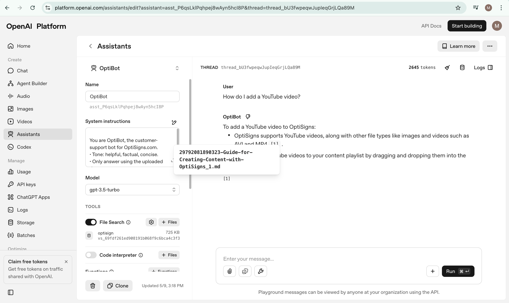

# Zendesk → OpenAI Vector Store Sync

A Python crawler that incrementally syncs Zendesk Help Center articles into an OpenAI Vector Store for RAG/Assistant usage.

---

# Features

- Incremental crawl Zendesk Help Center articles
- Convert HTML body → Markdown & Chunking strategy
- Upload chunks to OpenAI Vector Store
- Retry mechanism for robustness
- Local or DigitalOcean Spaces persistence
- Assistant + Vector Store auto bootstrap

---

# Architecture

Crawler call Zendesk API -> HTML to Markdown -> Chunking -> OpenAI File Upload -> OpenAI Vector Store

---

# Chunking Strategy

Although OpenAI Vector Store auto slipt chunk when upload markdown, but I still slipt markdown into chunk manually

Strategy: splits by: Markdown headers (#) or numbered lists (followed by >50 chars). Each chunk max 1000 chars with 200 chars overlap

Regex: r'(?=^#{1,6}\s)|(?=^\d+[\.)]\s.{50,})'

---

# Storage

Storage Schema: application state schema (JSON format)

- last_article_updated_at: checkpoint to stop crawling.
- map_synced_article: Map of article_id → edited_at to detect article edited
- open_ai: vector_store_id and assistant_id: use to no recreate each times start application.

## LocalStorage
Store application state in JSON file (storage.json)

## DigitalOceanSpacesStorage
Store application state in S3-compatible storage

---

# Incremental Sync

Tracking and store Last updated article was synced and article's edited time in storage

Call Zendesk API get list article decrease sorted by updated time

Stop crawling when get article have updated time less than Last updated article was synced. If state don't contain Last updated article was synced -> crawl only 1st page (30 article) then stop crawling

Check article: if it non-exist in map_synced_article -> it is new article -> add; if it exist but it's edited time larger than stored it's edited -> it was updated -> update; else -> skipped

Added and updated article will be processed

---

# Process article

Zendesk API article response have 'body' property which already be cleared (not contain nav/ads) -> markdownfy body to convert HTML to markdown format

Apply chunking strategy on markdown file then upload each chunk into OpenAI and Vector Store

If success: save state

---

# Retry logic

Apply retry logic for: calling Zendesk API, upload file to OpenAi

Retry attempt: 3, Waiting time if fail: 5 second

---

# Environment

OPENAI_API_KEY=
OPENAI_VECTOR_NAME=
STORAGE=local
ZENDESK_BASE_URL=
BUCKET=
AWS_ACCESS_KEY_ID=
AWS_SECRET_ACCESS_KEY=

---

# Install
pip install -r requirements.txt

# Run
python main.py

# ScreenShot When ask: "How do I add a YouTube video?"
